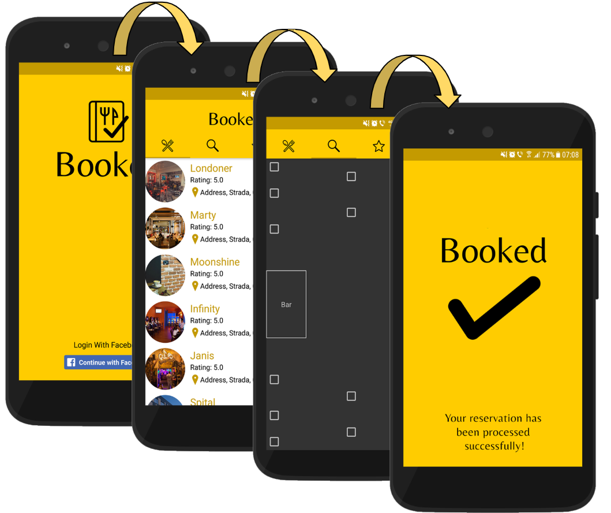

# Booked

  

**Introduction**  
Going out with friends/family represents an essencial part of everybody's social life and it has been demonstrated to be a very healthy habit, bot mentally and physically. That being said, a part of going out that everybody dreads is making the actual reservation. Calling to book a table is unpleasant and often results in misunderstandings, which can ruin the mood.  

**Solution**  
I decided to provide a solution to the outdated method of reservation in the form of a platform in which users can book tables at restaurants, bars, bistros etc.   
Thus, 'Booked' is a mobile application through which users can intuitively login with Facebook, see a listing of venues, choose their desired venue and reserve a table.

**Why Booked?**  
Booked offers a new feature that no other venue reservation app has. When booking a table, the user will presented with a graphical layout of the venue containing the already booked or occupied tables. Thus, the desired table can be selected, avoiding the problem of being placed in an unpleasant part of the venue. This feature can also be used as a last minute check to see if the place is not at full capacity to avoid walking in just to walk out immediately because of the lack of free tables.

  

**Notes**  
- This is my project for the Android Fundamentals course hosted by Atelierul Digital **Google**.
- This application is not finished, it is merely a prototype.
- For logging in I decided to use Firebase Auth.
- All the art and UI features were made by me.
